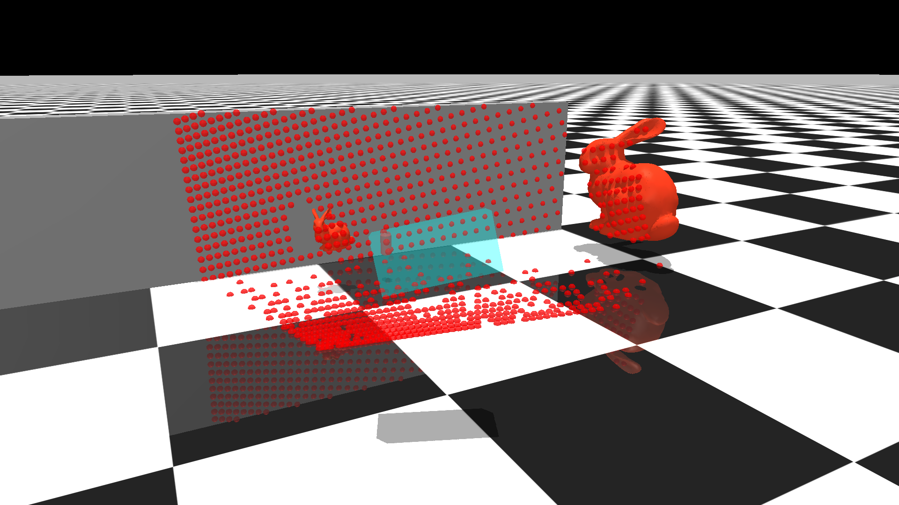
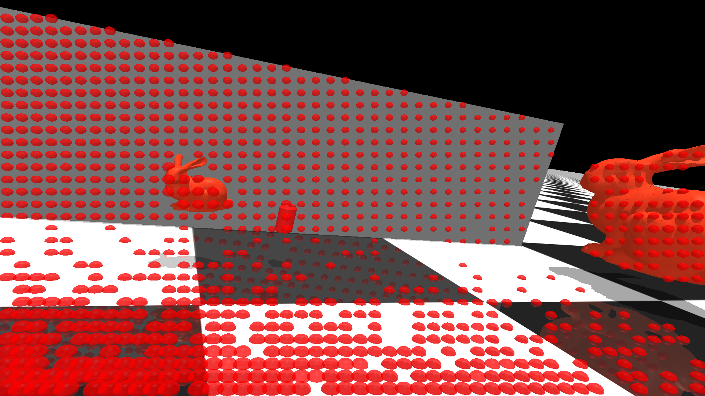
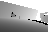
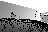
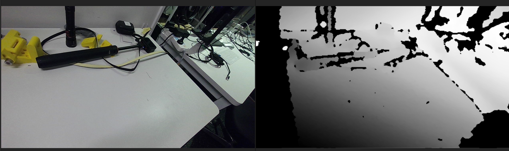
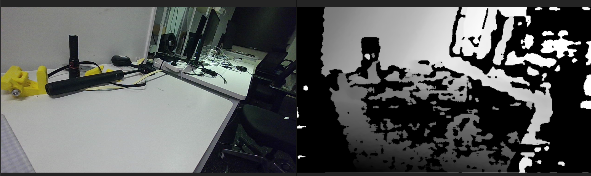

**Languages:** 
[English](README.md) | [简体中文](README.zh-CN.md)
# Sensor RayCaster Plugins
绑定在camear上，基于mj_ray实现的raycaster传感器,raycaster的参数尽量贴近isaaclab
其中raycaster_src可以直接使用C++ API，[参考](https://github.com/Albusgive/go2w_sim2sim)         
[📺视频演示](https://www.bilibili.com/video/BV1SSe1zLEVf/?spm_id_from=333.1387.homepage.video_card.click&vd_source=71e0e4952bb37bdc39eaabd9c08be754)    
[🤖插件功能演示](https://www.bilibili.com/video/BV1wYnvzgExg/?spm_id_from=333.1387.homepage.video_card.click&vd_source=71e0e4952bb37bdc39eaabd9c08be754)        
[🎮DEMO测试](#demo)

## sensors
mujoco.sensor.ray_caster            

mujoco.sensor.ray_caster_camera          
 
mujoco.sensor.ray_caster_lidar          
    
# Build
注意clone的mujoco版本要和将要使用的版本一致     
`git clone https://github.com/google-deepmind/mujoco.git`   
`cd mujoco/plugin`      
`git clone https://github.com/Albusgive/mujoco_ray_caster.git`    
`cd ..`     
修改mujoco的CMakeLists.txt
```cmake
add_subdirectory(plugin/elasticity)
add_subdirectory(plugin/actuator)
add_subdirectory(plugin/sensor)
add_subdirectory(plugin/sdf)
# 新增路径
add_subdirectory(plugin/mujoco_ray_caster)
```
`mkdir build`       
`cd build`      
`cmake ..`      
`cmake --build . #多线程编译使用 cmake --build . -j线程数`   
`cd bin`        
`mkdir mujoco_plugin`   
`cp ../lib/*.so ./mujoco_plugin/`   
test1:      
`./simulate ../../plugin/mujoco_ray_caster/model/ray_caster.xml`        
test2:      
`./simulate ../../plugin/mujoco_ray_caster/model/ray_caster2.xml`


# MJCF
## base config

### SensorData
**sensor_data_types:string list(n)**   
通过下划线组合数据模式，value任意长度字符串数组，会把这些数据按顺序拼接到mjData.sensordata中
date_type:  
&emsp;data 距离 米     
&emsp;image [0,255] (dis_range)的图像数据，开启噪声后可以选择读取源图像和噪声图   
&emsp;normal [0,1] (dis_range)归一化后数据，同上      
&emsp;pos_w 坐标系下射线命中点  没命中或超出测距为NAN       
&emsp;pos_b 传感器坐标系下射线命中点  没命中或超出测距为NAN     
&emsp;inv 反转数据      
&emsp;inf_zero 射线没有检测到的数据给定0，没有开启默认为inf_max     
&emsp;noise 数据是否带有噪声        
&emsp;distance_to_image_plane       
&emsp;image_plane_image     
&emsp;image_plane_normal        

| cfg \ data_type | data | image | normal | distance_to_image_plane | image_plane_image | image_plane_normal | pos_w | pos_b |
|-----------------|------|-------|--------|-------------------------|-------------------|---------------------|-------|-------|
| inv             | ✘    | ✔     | ✔      | ✘                       | ✔                 | ✔                   | ✘     | ✘     |
| inf_zero        | ✔    | ✔     | ✔      | ✔                       | ✔                 | ✔                   | ✘     | ✘     |
| noise           | ✔    | ✔     | ✔      | ✔                       | ✔                 | ✔                   | ✘     | ✘     |


exapmle: 
```XML
<config key="sensor_data_types" value="data data_noise data_inf_zero inv_image_inf_zero noise_image pos_w pos_b normal inv_normal" />
```

**dis_range:real(6),“1 1 1 0 0 0”**     
&emsp;测距范围

**geomgroup:real(6),“1 1 1 0 0 0”**     
&emsp;检测哪些组的几何体

**detect_parentbody:real(1),“0”**     
&emsp;是否检测传感器父body

### VisVisualize
**draw_deep_ray:real(7),“1 5 0 1 0 0.5 1”**     
&emsp;绘制射线 ratio width r g b a edge

**draw_deep_ray_ids:real(6+n),“1 5 1 1 0 0.5 list”**     
&emsp;绘制指定id的射线 ratio width r g b a id_list

**draw_deep:real(6),“1 5 0 0 1 0.5”**     
&emsp;绘制测量深度的射线 ratio width r g b a

**draw_hip_point:real(6),“1 0.02 1 0 0 0.5”**     
&emsp;绘制射线命中点 ratio point_size r g b a

**draw_normal:real(6),“1 0.02 1 1 0 0.5”**     
&emsp;绘制射线命中点法线 ratio width r g b a

exapmle:
```XML
<config key="draw_deep_ray" value="1 5 0 1 1 0.5 1" />
<config key="draw_deep_ray_ids" value="1 10 1 0 0 0.5 1 2 3 4 5 30" />
<config key="draw_deep" value="1 5 0 1 0" />
<config key="draw_hip_point" value="1 0.02" />
<config key="draw_normal" value="1 5 " />
```

### Noise
**noise_type:[uniform,gaussian,noise1,noise2,stereo_noise]**     
&emsp;噪声类型
**noise_cfg:n**     
|noise_type|noise_cfg|
|-|-|
|uniform|low high seed|
|gaussian|mean std seed|
|noise1|low high zero_probability seed|
|noise2|low high zero_probability min_angle max_angle low_probability high_probability seed|
|stereo_noise|pow seed|

#### noise1
在均值噪声基础上增加随机置0

#### noise2
noise2是根据近似的射线入射角度进行判断的噪声，在noise1的基础上从最小入射角到最到入射角[90,180]数据为0的概率是[low_probability,high_probability]
<div align="center">


</div>

#### stereo_noise
在使用stereo_noise的时候要确保baseline,lossangle和min_energy的有效性        
<font color="red">注意该噪声需要mujoco version >= 3.5.0</font>      
噪声模型说明：[stereo_noise](compute.zh-CN.md#3-stereo-noise--min-energy)
<div align="center">




</div>
<div align="center">


</div>


### Other
**compute_time_log:real(1),“0**     
&emsp;打印计算时间

**n_step_update:real(1),“1**     
&emsp;隔n_step计算一次

**num_thread:real(1),“0**     
&emsp;增加n个线程计算ray，提高性能，使用该参数时如果线程比较多需要每次重启程序

**lossangle:real(1),“0**     
&emsp;从命中点到相机向量与法线向量差角度，大于这个角度射线丢失，单位度，范围(0,90)         
<font color="red">该参数需要mujoco version >= 3.5.0</font>       
如下：左图为启用lossangle，右图为普通相机，演示见[ray_caster3.xml](./model/ray_caster3.xml)
<div align="center">


</div>


## RayCaster
**resolution:real(1),“0”**     
&emsp;分辨率

**size:real(2),“0 0”**     
&emsp;尺寸 米

**type:[base,yaw,world]”**     
&emsp;base 自坐标系相机lookat
&emsp;yaw 自坐标系yaw,世界z向下
&emsp;world 世界坐标系z向下


## RayCasterCamera
**focal_length:real(1),“0”**     
&emsp;焦距 cm

**horizontal_aperture:real(1),“0”**     
&emsp;画面水平尺寸 cm

**vertical_aperture:real(1),“0”**     
&emsp;画面垂直尺寸 cm

**size:real(2),“0 0”**     
&emsp;h_ray_num,v_ray_num

**baseline:real(1),“0”**     
&emsp;如果是双目深度相机则需要设置baseline，即两个相机之间的距离,可以还原出现实双目深度相机检测时的重影及边缘阴影现象
<div align="center">


</div>  

**min_energy:real(1),“0**   
&emsp;射线丢失阈值，见[min_energy](compute.zh-CN.md#3-stereo-noise--min-energy)     
<font color="red">该参数需要mujoco version >= 3.5.0</font>   

## RayCasterLidar
**fov_h:real(1),“0”**     
&emsp;fov_h 角度

**fov_v:real(1),“0”**     
&emsp;fov_v 角度

**size:real(2),“0 0”**     
&emsp;h_ray_num,v_ray_num


# GetData
demo中提供了读取演示          
mjData.sensordata中是所有的数据     
mjData.plugin_state中储存了数据info
h_ray_num,v_ray_num, list[data_point,data_size]
data_point是相对于该传感器总数据的数据位置

exapmle:    
**C++:**
```C++
std::tuple<int, int, std::vector<std::pair<int, int>>>
get_ray_caster_info(const mjModel *model, mjData *d,
                    const std::string &sensor_name) {
  std::vector<std::pair<int, int>> data_ps;
  int sensor_id = mj_name2id(m, mjOBJ_SENSOR, sensor_name.c_str());
  if (sensor_id == -1) {
    std::cout << "no found sensor" << std::endl;
    return std::make_tuple(0, 0, data_ps);
  }
  int sensor_plugin_id = m->sensor_plugin[sensor_id];
  int state_idx = m->plugin_stateadr[sensor_plugin_id];

  for (int i = state_idx + 2;
       i < state_idx + m->plugin_statenum[sensor_plugin_id]; i += 2) {
    data_ps.emplace_back(d->plugin_state[i], d->plugin_state[i + 1]);
  }
  int h_ray_num = d->plugin_state[state_idx + 0];
  int v_ray_num = d->plugin_state[state_idx + 1];
  return std::make_tuple(h_ray_num, v_ray_num, data_ps);
}
```
**Python:**
```Python
def get_ray_caster_info(model: mujoco.MjModel, data: mujoco.MjData, sensor_name: str):
    data_ps = []
    sensor_id = mujoco.mj_name2id(model, mujoco.mjtObj.mjOBJ_SENSOR, sensor_name)
    if sensor_id == -1:
        print("Sensor not found")
        return 0, 0, data_ps
    sensor_plugin_id = model.sensor_plugin[sensor_id]
    state_idx = model.plugin_stateadr[sensor_plugin_id]
    state_num = model.plugin_statenum[sensor_plugin_id]
    for i in range(state_idx + 2, state_idx + state_num, 2):
        if i + 1 < len(data.plugin_state):
            data_ps.append((int(data.plugin_state[i]), int(data.plugin_state[i + 1])))
    h_ray_num = (
        int(data.plugin_state[state_idx]) if state_idx < len(data.plugin_state) else 0
    )
    v_ray_num = (
        int(data.plugin_state[state_idx + 1])
        if state_idx + 1 < len(data.plugin_state)
        else 0
    )
    return h_ray_num, v_ray_num, data_ps
```
# Demo
## C++
```
cd demo/C++
mkdir build
cd build
cmake ..
make
./sensor_data
```
## Python
```
pip install mujoco-python-viewer
cd demo/Python
python3 sensor_data_viewer.py
python3 view_launch.py
python3 stereo_camera.py
```
## ROS2
注意：需要安装cyclonedds-cpp,fastdds使用会存在bug
```
sudo apt update
sudo apt install ros-<distro>-rmw-cyclonedds-cpp
export RMW_IMPLEMENTATION=rmw_cyclonedds_cpp
```
### C++&cmake
```
cd demo/ROS2/C++
mkdir build
cd build
cmake ..
make
./sensor_data
```
### C++&colcon
```
cd demo/ROS2/colcon
colcon build
source install/setup.bash
ros2 run ray_caster sensor_data
```
# 技术交流
