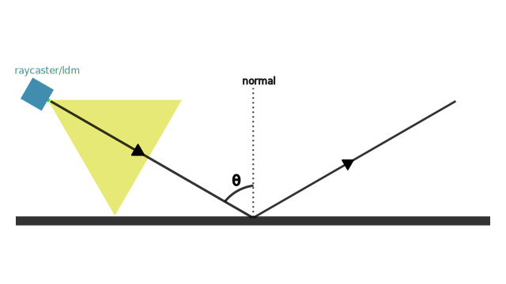
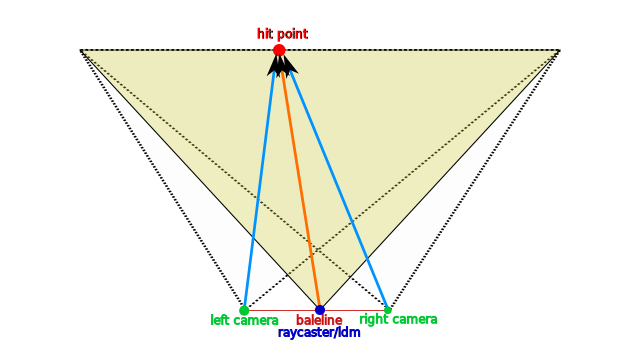
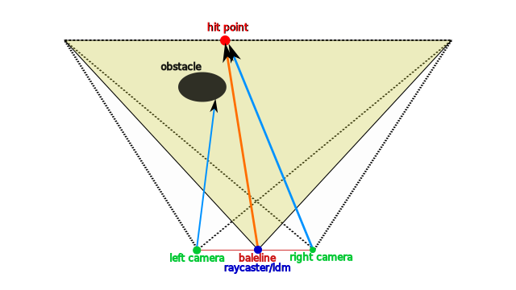
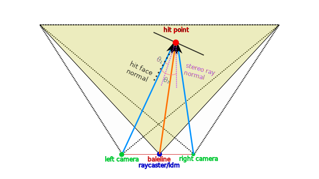
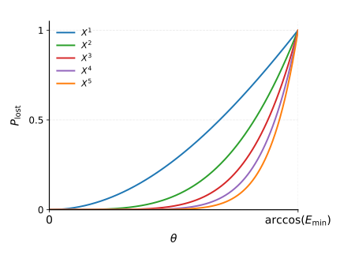

**Languages:** 
[English](compute.md) | [简体中文](compute.zh-CN.md)
# Computation Model

## 1. Loss Angle

$\theta$ 为从 Raycaster 或 LDM (light detetion and ranging moudle) 发射出的光线与命中位置表面法向量的夹角。

*   **判定规则**：当 $\theta > \text{lossangle}$ 时，数据会产生丢失。

---

## 2. Stereo Model

该模型用于模拟真实双目相机测距时产生的**数据阴影 (Data Shadow)**：

1.  **光线发射**：首先从 Raycaster/LDM 射出的 Ray 如果命中物体表面，会产生一个命中点 (Hit Point)。
2.  **回射检测**：从 `left_camera` 和 `right_camera` 分别发射一条指向该命中点位置的 Ray。
3.  **距离校验**：
    *   如果 Ray 测量的距离与 Hit Point 到 Camera 的欧式距离相等，则标记为**正常数据**。
    *   如果有任意一条 Ray 的测量数据不相等（通常意味着视线被遮挡），则会发生**数据丢失**。

---

## 3. Stereo Noise & Min Energy

该噪声产生的原因基于能量角度分析：

*   **物理原理**：当 Raycaster/LDM 发射光线命中物体表面时，反射光强会随着视线与表面法线夹角的增大而减小。实际上，光线能量会按照镜面反射光路传播，导致直接反射回 Stereo Camera 的光强显著降低。
*   **现象**：垂直看向表面时深度数据最稳定；斜视表面时会产生大量噪声，导致数据更容易丢失。

对此，我们建立了一个概率模型来模拟数据丢失：

### 计算逻辑

1.  **计算夹角余弦**：
    $\theta_1$ 和 $\theta_2$ 分别是反射回 Stereo Camera 的光路向量与命中表面法线向量的夹角。通过计算 `stereo_ray_normal` 和 `hit_face_normal` 的余弦相似度 $\cos(\theta)$ 获得。

2.  **计算能量 $E$**：      
    $$E = \min(\cos(\theta_1), \cos(\theta_2))$$

3.  **能量判定与概率计算**：
    我们将计算出的能量 $E$ 与参数 `min_energy` 进行比较：       
    **Case 1**: 如果 E <= min_energy，则数据直接丢失       
    **Case 2**: 如果 E > min_energy，则计算丢失概率$P_{loss}$。         

    噪声模型参数 `pow` 为归一化后的反转能量的幂：

    $$X = 1 - \frac{E}{1 - min_energy}$$

    $$P_{loss} = X^{pow}$$

## 4. Domain Randomization (域随机化)
*   **域随机化方案**：基于上述模型，可以对参数 `min_energy` 和 `pow` 进行随机化。
*   **进阶拓展**：可以根据 `geom_id` 分配特定的参数范围，即 `(min_energy_range, pow)`。

## 5. IsaacLab stereo_vision_ray_caster_camera
*   **状态**：等待测试

## 6. mjlab stereo_vision_ray_caster_camera
*   **状态**：等待测试